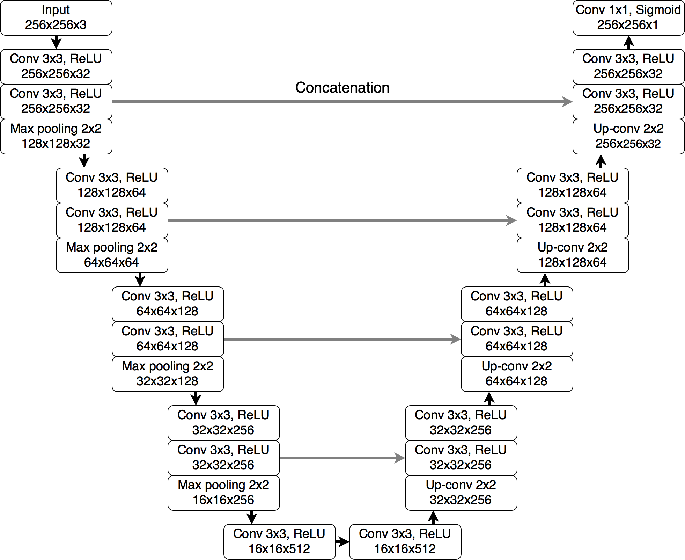

# brain-tumor-segmentation
A UNet model for brain tumor segmentation. Pytorch version. 
A web app to visualize learning curves of pretrained models and make prediction with pretrained models.

## Unet

## Training Model

 To train the model on your own computer:
1. Download project
2. Install dependencies by runing `pip install -r requirements.txt` in terminal 
3. Train the model by runninng `train.py`:

## Test result of pretrained Model
| Model                                         | IOU score | Dice score |
|-----------------------------------------------|-----------|------------|
| dice_loss + cross_entropy_loss, l_rate=0.0001 | 0.7465402 | 0.8548798  |
| dice_loss, l_rate=0.0001                      | 0.7388876 | 0.8498393  |
| dice_loss + cross_entropy_loss, l_rate=0.001  | 0.7465402 | 0.8548789  |
| dice_loss + cross_entropy_loss, l_rate=0.01   | 0.7522497 | 0.8586102  |
| dice_loss + cross_entropy_loss, l_rate=0.1    | 0.7797701 | 0.8762593  |

## Make Prediction

To start the web app on your own computer:
1. Download project
2. install dependencies by runing `pip install -r requirements.txt` in terminal 
3. open the page by running `streamlit run home.py` in terminal.

